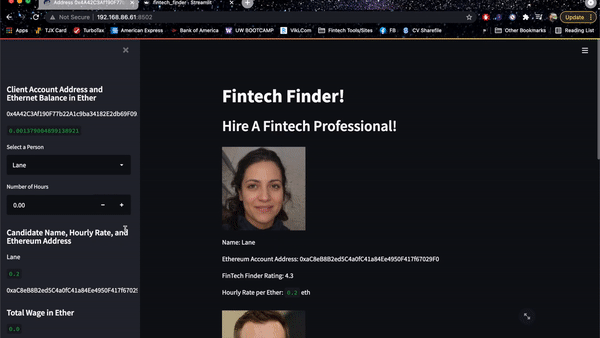
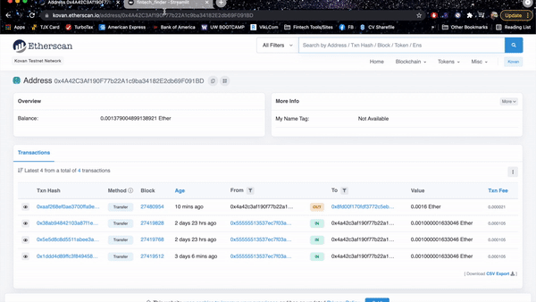
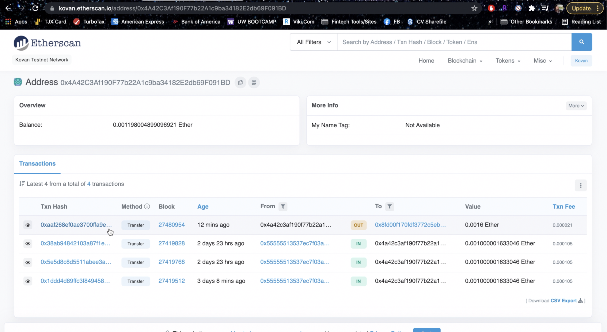
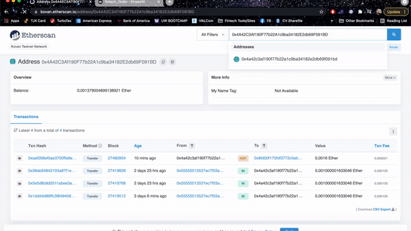
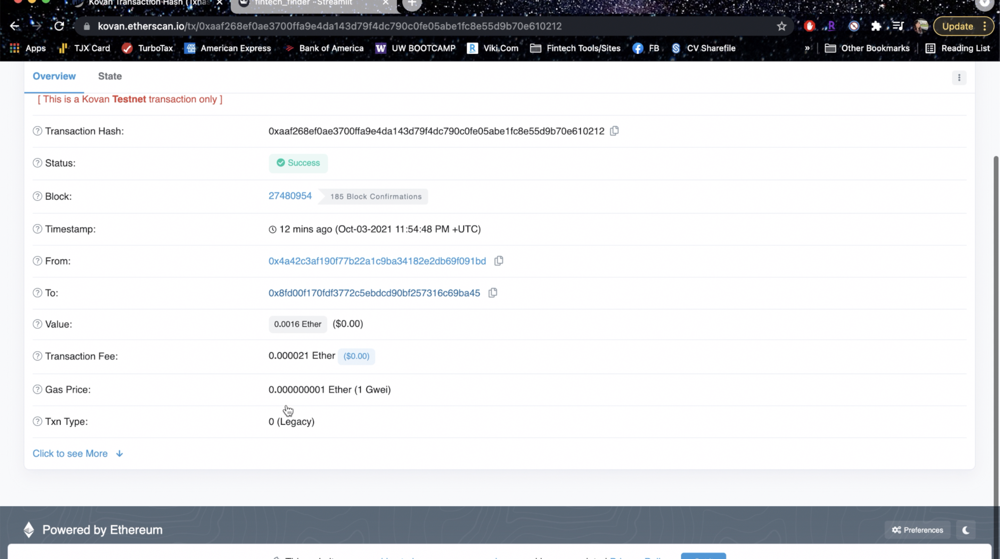
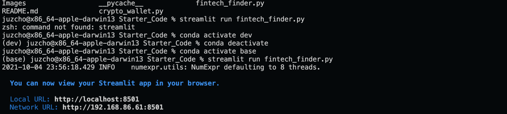
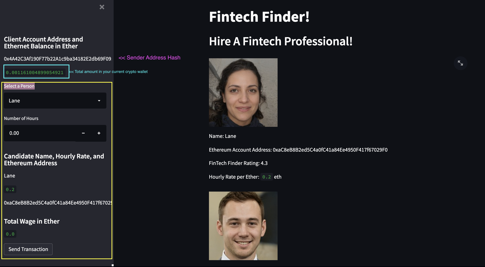
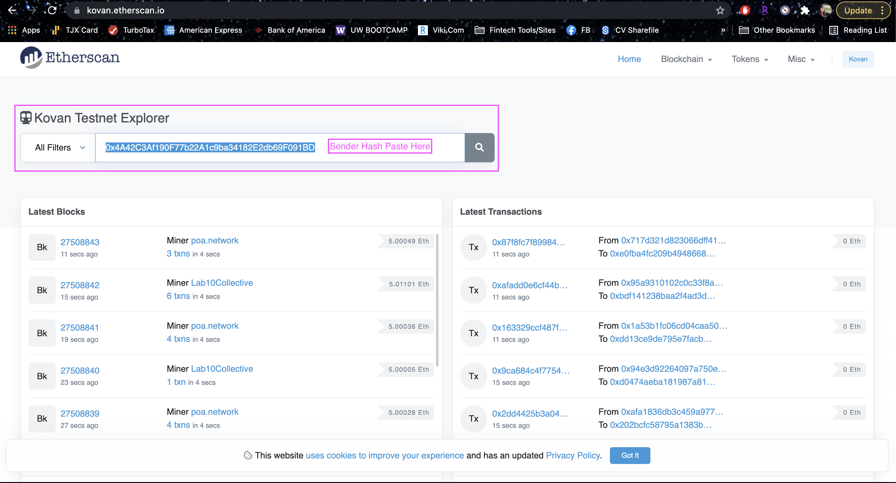

# Module 19 Challenge: Fintech Finder and Crypto Wallet

## Table of Contents

[Fintech Finder and Crypto Wallet](https://github.com/juzcho/Module-19-Crypto-Wallet-Fintech-Finder#fintech-finder-and-crypto-wallet)

[Technologies](https://github.com/juzcho/Module-19-Crypto-Wallet-Fintech-Finder#technologies)

[Installation Guide](https://github.com/juzcho/Module-19-Crypto-Wallet-Fintech-Finder#installation-guide)

[Examples](https://github.com/juzcho/Module-19-Crypto-Wallet-Fintech-Finder#examples)

[Usage](https://github.com/juzcho/Module-19-Crypto-Wallet-Fintech-Finder#usage)

[Contributors](https://github.com/juzcho/Module-19-Crypto-Wallet-Fintech-Finder#contributors)

[License](https://github.com/juzcho/Module-19-Crypto-Wallet-Fintech-Finder#license)

---

## Fintech Finder and Crypto Wallet

This project is about creating a streamlit application called Fintech Finder to hire a fintech professional and pay them with using the user's crypto wallet.  This tool has been integrated with the Ethereum blockchain network in order to enable the customers to instantly pay the Fintech professionals whom they hire with cryptocurrency.

---

## Technologies

This project leverages **[python version 3.8.5](https://www.python.org/downloads/)** with the following packages and modules:

* [pandas](https://pandas.pydata.org/docs/) - *version 1.3.2* - This was used to be able to easily manipulate dataframes and create dataframes.

* [Streamlit](https://streamlit.io/) - *version 0.84.2* - To be able to view the application into a web browser and that users can interact with the ledger.

* [Data Classes](https://docs.python.org/3/library/dataclasses.html) -This module provides a decorator and functions for automatically adding generated special methods to classes, which managed us to use class blocks into our code structure.

* [datetime](https://docs.python.org/3/library/datetime.html) - While date and time arithmetic is supported, the focus of the implementation is on efficient attribute extraction for output formatting and manipulation. In our case, we used this to be able to determine the UTC timezoon to create a time stamp in our blockchain.

* [typing](https://docs.python.org/3/library/typing.html)- This allows us to use the most fundamental support consisting of the types Any, Union, Tuple, Callable, TypeVar, and Generic.

* [hashlib](https://docs.python.org/3/library/hashlib.html)- This module implements a common interface to many different secure hash and message digest algorithms. In our application, we use SHA256 to return a hexdigest.

* [web3.py](https://web3py.readthedocs.io/en/stable/overview.html) - This is a Python library for connecting to and performing operations on Ethereum-based blockchains.

* [eth-tester](https://pypi.org/project/eth-tester/) - This is a Python library that provides access to the tools we’ll use to test Ethereum-based applications.

* [mnemonic](https://pypi.org/project/mnemonic/) - This is a Python implementation for generating a 12- or 24-word mnemonic seed phrase based on the BIP-39 standard.

* [bip44](https://pypi.org/project/bip44/) - This is a Python implementation for deriving hierarchical deterministic wallets from a seed phrase based on the BIP-44 standard.

* [Infura API](https://infura.io/register) - An API that provides instant access to the Ethereum network over HTTPS (i.e., the web). You will need to create an account with Infura.

---
## Installation Guide

### 1. Install the application, Streamlit and Web3.py into your dev or base environment:

`pip install streamlit`

`pip install web3==5.17`

`pip install eth-tester==0.5.0b3` or  `pip install eth-tester`

`pip install mnemonic`

`pip install bip44`

### 2. Use VSCODE to view and edit the fintech_finder.py

---
## Examples

### **This gif should show you what happens when payment is sent on Etherscan.** 

#### *Fintech Finder Send Transaction (Streamlit):*

#### *Etherscan Sender Info Address:*

*Screenshot of Sender Address:*

#### *Transaction Hash and Recipient Transaction Histories:*

*Screenshot of Transaction Hash*

---

## Usage

### To use the Streamlit Application:

1. Go to your terminal and direct your folder to where the file for our pychain.py is located. Then on your terminal, type the following:

    `streamlit run fintech_finder.py` 

    This should open up a new internet browser automatically, then it will allow you to interact with the software.

    

2. To use the application on Streamlit:

- Select a Person: Review each person's information since it gives you how much their hourly rate is.
- Input the Number of Hours: Remember to only hire them based on how much remaining crypto you still have.

    

3. To use the Kovan Etherscan, go to this website: https://kovan.etherscan.io/ 

- Copy and paste the Sender Address Hash (check screen shot above to know where to get this), then click search. It should show the list of recent transaction and current balance you still have in the crypto wallet. Check the gif on Examples section to see the rest. 

    

---

## Contributors

Contributed by: Justine Cho

Email: juz317_cho@yahoo.com

[ LinkedIn](https://www.linkedin.com/in/justinecho)

---

## License

### **MIT License**

Copyright (c) [2021] [Justine Cho]

Permission is hereby granted, free of charge, to any person obtaining a copy
of this software and associated documentation files (the "Software"), to deal
in the Software without restriction, including without limitation the rights
to use, copy, modify, merge, publish, distribute, sublicense, and/or sell
copies of the Software, and to permit persons to whom the Software is
furnished to do so, subject to the following conditions:

The above copyright notice and this permission notice shall be included in all
copies or substantial portions of the Software.

THE SOFTWARE IS PROVIDED "AS IS", WITHOUT WARRANTY OF ANY KIND, EXPRESS OR
IMPLIED, INCLUDING BUT NOT LIMITED TO THE WARRANTIES OF MERCHANTABILITY,
FITNESS FOR A PARTICULAR PURPOSE AND NONINFRINGEMENT. IN NO EVENT SHALL THE
AUTHORS OR COPYRIGHT HOLDERS BE LIABLE FOR ANY CLAIM, DAMAGES OR OTHER
LIABILITY, WHETHER IN AN ACTION OF CONTRACT, TORT OR OTHERWISE, ARISING FROM,
OUT OF OR IN CONNECTION WITH THE SOFTWARE OR THE USE OR OTHER DEALINGS IN THE
SOFTWARE.
